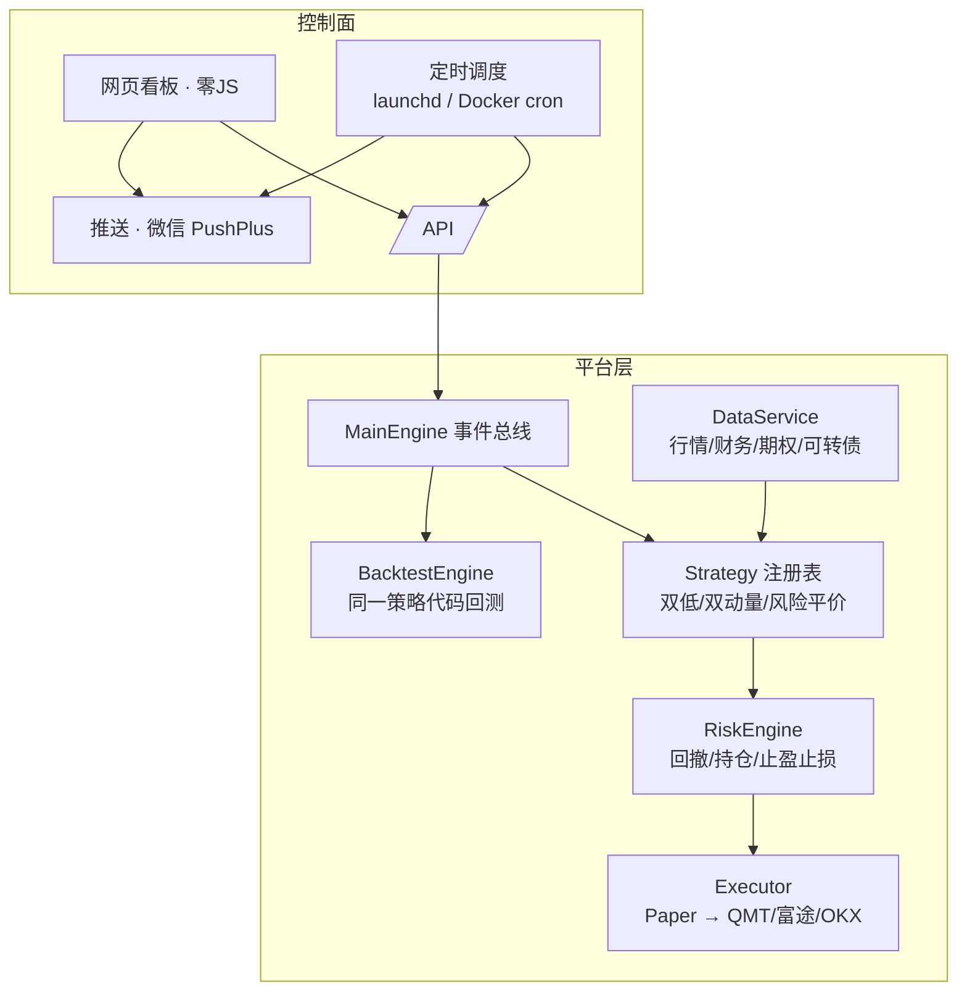

<div align="center">

# 星辰投研团 · Xingchen Quant OS

**面向普通金融小白的量化交易操作系统**

覆盖 A股 / 港股 / 美股 / 加密货币 · 支持现货 / 期货 / ETF / 期权 / 可转债

自动数据 → 自动研究 → 自动模拟盘 → 自动风控 → 自动推送

[](https://www.python.org/)
[](LICENSE)
[]()
[]()
[]()

</div>

---

## ✨ 亮点

- **诚实的研究纪律**：16+ 份研究报告，全部经过统一门控（事件研究/IC → walk-forward 样本外含成本），不凑数、不美化
- **三策略并行模拟盘**：可转债双低（实盘候选）、双动量 ETF、风险平价底仓——收益/趋势/稳定三档画像，各自对照基准
- **v4 平台引擎**：事件驱动核心（对标 vnpy/freqtrade）、策略注册制、止盈止损自动退出、SQLite 交易流水
- **合并 paddy-quant-workbench**：期权 Gamma Exposure（GEX）、参数寻优（反过拟合）、多标的规格引擎、ATR 止损/保本移动/凯利仓位（原仓库已归档）
- **全自动运行**：launchd / Docker 内置定时（每日全链路、每小时学习、周报、月报），推送直达微信
- **零 JS 网页看板**：任何浏览器可用；Obsidian 知识库全同步；GitHub 版本管理可复现

## 🏗 架构



## 📦 功能总览

| 模块 | 说明 |
|------|------|
| 数据层 | A股 1119 / 港股 66 / 美股 65 / 加密 16 / 期货 10 / 可转债 1000+ / 港股分红，多源自动降级 |
| 研究层 | 因子评估 / 事件研究 / walk-forward / DSR 门控，16+ 份诚实报告 |
| 策略层 | 可转债双低（信用过滤）、双动量 ETF、逆波动率风险平价——三模拟盘运行中 |
| 平台引擎 | 事件驱动核心、策略注册制、止盈止损自动退出、SQLite 交易/净值流水 |
| 期权分析 | GEX 快照（Call Wall/Put Wall/Zero Gamma，看板展示） |
| 参数寻优 | walk-forward 样本外排序 + 保留集终验 + 过拟合检测（`engine_cli --optimize`） |
| 多标的规格 | 合约乘数/保证金/费用/可卖空统一描述（`engine/instruments.py`） |
| 自动化 | launchd/Docker 定时：全链路 / 每小时学习 / 周报 / 月报 / 推送 |
| 看板 | 零 JS 网页看板（概览/策略/风控/体检/交易/操作台/行情/学习/报告） |
| 知识库 | Obsidian 同步（研究看板/用户手册/学习日志/系统状态） |
| 学习机制 | 每日 GitHub+RSS 深学习 + 每小时成果卡片（核心观点/可测假设） |

## 🚀 快速开始

### 方式一：本机（macOS）

```bash
git clone git@github.com:chonpszhou/xingchen-quant-os.git
cd xingchen-quant-os
pip install -r requirements.txt
python3 scripts/setup_wizard.py --auto     # 一键：装自动化 + 复检
python3 scripts/run_all.py all             # 全链路：数据→信号→模拟盘→摘要
python3 scripts/acceptance_test.py         # 一键验收（10 项）
python3 scripts/dashboard.py               # 看板 → http://127.0.0.1:8080
```

### 方式二：Docker

```bash
docker compose build
docker compose up -d                       # 内置 cron：日/小时/周/月全自动
# 看板 http://localhost:8080（仅本机可访问）
```

## 🖥 网页看板

`http://localhost:8080` —— 三模拟盘净值与基准双线图、风控状态、策略体检（回撤/滚动夏普/月度热力图）、交易流水、操作台（任务排队/取消）、自选行情、每日学习。

## 📚 文档

| 文档 | 说明 |
|------|------|
| [交付清单](docs/交付清单.md) | 目标→证据逐项核查（27 项） |
| [用户操作手册](docs/用户操作手册.md) | 小白版：安装/日常/纪律/30天日历 |
| [平台架构设计](docs/平台架构设计.md) | v4 引擎设计（对标 vnpy/freqtrade） |
| [读懂模拟盘报告](docs/读懂模拟盘报告.md) | 月报/风控指标人话翻译 |
| [交易执行与风控退出](docs/交易执行与风控退出.md) | 下单链路与止盈止损说明 |
| [券商开户与接入指引](docs/券商开户与接入指引.md) | QMT/富途/OKX 实盘接入步骤 |
| [系统总览](docs/系统总览.md) | 架构/策略/风险一页通 |

## 🧪 测试与验收

```bash
python3 scripts/acceptance_test.py   # 10 项：连接/引擎一致/前向状态机/风控/一致性/预期/预告/摘要/launchd/git
python3 scripts/engine_cli.py --strategy dual_momentum --mode backtest   # 引擎回测
```

## ⚖️ 免责声明

本项目仅供学习研究参考，**不构成任何投资建议**。所有策略均需先经模拟盘验证（连续 3 个月跑赢基准 + 回测-模拟一致）后才可考虑实盘。市场有风险，入市需谨慎。
